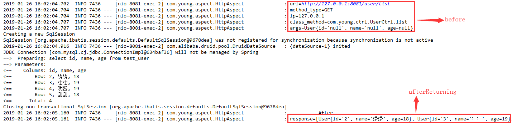
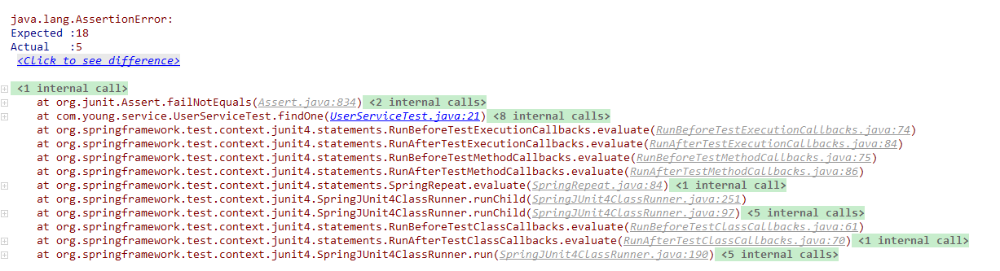
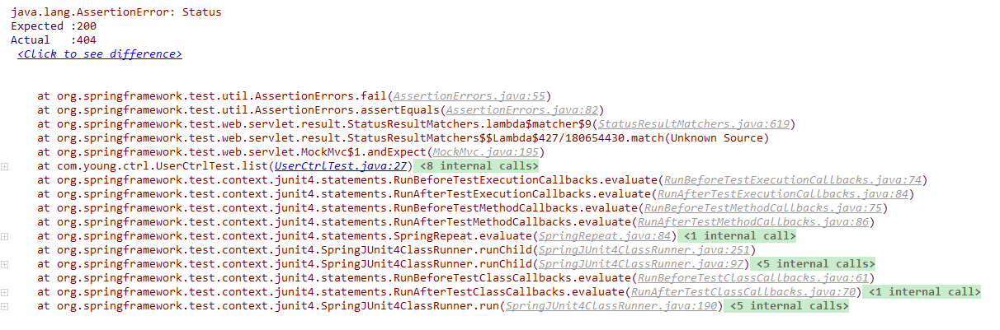

# Table of Contents

* [boot-example](#boot-example)
    * [一. 前言](#一-前言)
    * [二. springboot知识整理](#二-springboot知识整理)
      * [1.springboot的特点](#1springboot的特点)
      * [2.hello,springboot!](#2hellospringboot)
      * [3.自定义属性配置](#3自定义属性配置)
      * [4.数据库操作相关配置依赖](#4数据库操作相关配置依赖)
      * [5.restful API](#5restful-api)
      * [6.事务管理](#6事务管理)
      * [7.AOP统一处理请求日志](#7aop统一处理请求日志)
      * [8.统一返回结果和异常处理](#8统一返回结果和异常处理)


# boot-example
### 一. 前言 
        从2016年底springboot的技术预研,到2017年初正式使用springboot相关技术搭建并运行项目,一晃已经到2019年了.
    两年过去了,在后续的springboot项目开发中,陆续集成并使用了不同类型的技术方案.
        数据库mysql,mongodb,redis,文件上传fastdfs,自动部署jenkins等等.但在此我不会对这些相关集成的技术进行详细
    的说明,而只针对于最基本的项目搭建和CRUD业务进行example过程记录.
        一方面是两年过去了,相关的集成技术及应用文档在很多大牛的博客中都能找到完整的解决和应用方案,并且很多大牛还在
    博客中开放了评论和提问的功能,实现了"性感大牛,在线指导",在此我就不一一赘述了.另一方面,example这个项目主要是为了能
    够快速而有效的进行web开发而整理出来的一个脚手架,结合springboot两年的使用经验,尽量做到简洁明了,拿来即用. 

* 大牛的博客: [纯洁的微笑](http://www.ityouknow.com/) , [方志朋的博客](https://www.fangzhipeng.com/)
    
### 二. springboot知识整理
> 前置知识:  
1.maven构建项目  
2.spring注解  
3.restful api  

#### 1.springboot的特点
* 化繁为简,简化配置       
* 当前应用最多框架
* 微服务入门级微框架(springboot-->springcloud-->微服务)

#### 2.hello,springboot!
* idea编辑器使用 [idea官网下载](https://www.jetbrains.com/idea/) , [idea快捷键及使用技巧](https://www.cnblogs.com/jajian/category/1280011.html)
* 项目构建,建议使用spring官网提供的入口 https://start.spring.io/ 进行构建,构建完成后项目会自动下载zip包 
* idea导入项目,左上角File-->Open,然后选中zip包解压后的项目
* dependency中添加spring-boot-starter-web
* 新建类HelloCtrl,并写一个say方法
```
@RestController
public class HelloCtrl {
    @GetMapping(value = {"/hello", "/hi"})
    public String say() {
        return "hello,springBoot!";
    }
}
```  
* 启动项目后就可以访问127.0.0.0/hello 就可以看到"hello,springBoot!"

#### 3.自定义属性配置  
* application.yml使用,由properties改为yml,配置更加简洁
* 获取配置中的值@Value
```
 @Value("${name}")
 private String name;
```
* 配置之中使用配置
```
content: "i'm ${name},age is ${age}"
```
* 配置映射实体类@Component,@ConfigurationProperties 
```
yml配置: 
people:
  name: xiaoming
  age: 19
```  
```
实体类:
@Component
@ConfigurationProperties(prefix = "people")
public class PeopleProperties {
    private String name;
    private Integer age;
    getter,setter...
}  
```
* dev,prod不同环境配置切换,增加application-dev.yml和application-prod.yml.  
idea中根据application.yml中spring.profiles.active属性值变化进行切换.  
服务器上使用java -jar example.jar启动时增加--spring.profiles.active=prod环境参数,进行不同环境配置动态切换
```
spring:
  profiles:
    active: dev
```

#### 4.数据库操作相关配置依赖  
* mysql
```
spring:
  datasource:
    url: jdbc:mysql://192.168.4.99:3306/test?useUnicode=true&characterEncoding=utf8&serverTimezone=GMT
    username: develop
    password: develop
    driver-class-name: com.mysql.cj.jdbc.Driver
    type: com.alibaba.druid.pool.DruidDataSource
```
```
<dependency>
    <groupId>mysql</groupId>
    <artifactId>mysql-connector-java</artifactId>
</dependency>
<dependency>
    <groupId>com.alibaba</groupId>
    <artifactId>druid</artifactId>
    <version>1.1.0</version>
</dependency>
```
* mybatis
```
mybatis:
  configuration:
    log-impl: org.apache.ibatis.logging.stdout.StdOutImpl
    mapUnderscoreToCamelCase: true
  mapperLocations:
    - classpath*:mybatis/**/*.xml
```
```
<dependency>
    <groupId>org.mybatis.spring.boot</groupId>
    <artifactId>mybatis-spring-boot-starter</artifactId>
    <version>1.3.2</version>
</dependency>
```
* mybatis自动生成插件
```
<plugin>
    <groupId>org.mybatis.generator</groupId>
    <artifactId>mybatis-generator-maven-plugin</artifactId>
    <version>1.3.2</version>
    <configuration>
        <configurationFile>generatorConfig.xml</configurationFile>
        <verbose>true</verbose>
        <overwrite>true</overwrite>
    </configuration>
    <dependencies>
        <dependency>
            <groupId>mysql</groupId>
            <artifactId>mysql-connector-java</artifactId>
            <version>5.1.46</version>
        </dependency>
    </dependencies>
</plugin>
```
generatorConfig.xml自动生成配置文件
```
<?xml version="1.0" encoding="UTF-8"?>
<!DOCTYPE generatorConfiguration PUBLIC "-//mybatis.org//DTD MyBatis Generator Configuration 1.0//EN" "http://mybatis.org/dtd/mybatis-generator-config_1_0.dtd">
<generatorConfiguration>
  <context id="context1">
    <jdbcConnection connectionURL="jdbc:mysql://192.168.4.99:3306/dev_bus" driverClass="com.mysql.jdbc.Driver" password="develop" userId="develop" />
    <javaModelGenerator targetPackage="com.young.bootexample.model" targetProject="src/main/java" />
    <sqlMapGenerator targetPackage="mybatis.auto" targetProject="src/main/resources" />
    <javaClientGenerator targetPackage="com.young.bootexample.dao" targetProject="src/main/java" type="XMLMAPPER" />
    <table tableName="test_user"></table>
    <table tableName="***"></table>
    ...
  </context>
</generatorConfiguration>
```
在数据库设计完成后,对应的表名配置完成后,使用idea中右侧maven-->Plugins-->mybatis-generator,自动生成对应model,mapper,xml文件,简化开发

#### 5.restful API
* 创建UserCtrl
```
@RestController
public class UserCtrl {

    @Autowired
    private UserService userService;

    @PostMapping("/user")
    public void add(@RequestBody TestUser user) {
        userService.add(user);
    }

    @PutMapping("/user")
    public void edit(@RequestBody TestUser user) {
        userService.edit(user);
    }

    @GetMapping("/user")
    public TestUser findOne(@RequestParam("id") String id) {
        return userService.findOne(id);
    }

    @GetMapping("/user/list")
    public List<TestUser> list(TestUser user) {
        return userService.list(user);
    }

    @DeleteMapping("/user")
    public void del(@RequestParam("id") String id) {
        userService.del(id);
    }
}
```
请求调用遵循restful风格,post,delete,put,get,一一对应增删改查,
* 创建UserService接口及实现类UserServiceImpl
```
public interface UserService {

    List<TestUser> list(TestUser user);

    void add(TestUser user);

    void edit(TestUser user);

    TestUser findOne(String id);

    void del(String id);
}
```
```
@Service
public class UserServiceImpl implements UserService {

    @Autowired
    private TestUserMapper mapper;

    @Override
    public List<TestUser> list(TestUser user) {
        TestUserExample e = new TestUserExample();
        TestUserExample.Criteria c = e.createCriteria();
        if (null != user) {
            if (null != user.getId()) {
                c.andIdEqualTo(user.getId());
            }
            if (null != user.getName()) {
                c.andNameEqualTo(user.getName());
            }
            if (null != user.getAge()) {
                c.andAgeEqualTo(user.getAge());
            }
        }
        return mapper.selectByExample(e);
    }

    @Override
    public void add(TestUser user) {
        mapper.insert(user);
    }

    @Override
    public void edit(TestUser user) {
        mapper.updateByPrimaryKey(user);
    }

    @Override
    public TestUser findOne(String id) {
        return mapper.selectByPrimaryKey(id);
    }

    @Override
    public void del(String id) {
        mapper.deleteByPrimaryKey(id);
    }

}
```
整个CRUD模块完成,两个类UserCtrl,UserServiceImpl,一个接口UserService.对应的model,mapper,xml都由mybatis-generator自动生成,代码简洁明了

#### 6.事务管理
*  使用@Transactional进行事务管理,保证方法中要么同时成功,要么同时失败,事务回滚
```
@Override
@Transactional
public void addTwo() {
    TestUser user = new TestUser();
    user.setName("军军");
    user.setAge(20);
    mapper.insert(user);
    
    TestUser user1 = new TestUser();
    user1.setName("壮司机");
    mapper.insert(user1);
}
```
 

#### 7.AOP统一处理请求日志
* AOP是一种编程范式,与语言无关,是一个程序设计思想.  
面向切面(AOP) : Aspect Oriented Programming  
面向对象(OOP) : Object Oriented Programming  
面向过程(POP) : Procedure Oriented Programming  
* 面向过程(C)-->到面向对面(java)-->面向切面
* 将通用逻辑从业务逻辑中分离出来
* 添加spring-boot-starter-aop依赖
```
<dependency>
    <groupId>org.springframework.boot</groupId>
    <artifactId>spring-boot-starter-aop</artifactId>
</dependency>
```
* 编写HttpAspect请求日志切面
```
@Aspect
@Component
public class HttpAspect {

    private final static Logger log = LoggerFactory.getLogger(HttpAspect.class);

    @Pointcut("execution(public * com.young.ctrl.UserCtrl.*(..))")
    public void log() {
    }

    @Before("log()")
    public void Before(JoinPoint point) {
        ServletRequestAttributes attributes = (ServletRequestAttributes) RequestContextHolder.getRequestAttributes();
        HttpServletRequest request = attributes.getRequest();
        //url
        log.info("url={}", request.getRequestURL());
        //method_type
        log.info("method_type={}", request.getMethod());
        //ip
        log.info("ip={}", request.getRemoteAddr());
        //类方法
        log.info("class_method={}", point.getSignature().getDeclaringTypeName() + "." + point.getSignature().getName());
        //参数
        log.info("args={}", point.getArgs());
    }

    @After("log()")
    public void doAfter() {
        log.info("----------After----------");
    }

    @AfterReturning(pointcut = "log()", returning = "object")
    public void doAfterReturning(Object object) {
        log.info("response={}", object);
    }
}
```
* 查看日志截图  


#### 8.统一返回结果和异常处理
* 统一返回结果,定义Result结果封装类和ResultUtil工具类
```
@JsonInclude(JsonInclude.Include.NON_NULL)
public class Result {

    private Integer code;

    private String msg;

    private Object data;

    public Integer getCode() {
        return code;
    }

    public Result setCode(Integer code) {
        this.code = code;
        return this;
    }

    public String getMsg() {
        return msg;
    }

    public Result setMsg(String msg) {
        this.msg = msg;
        return this;
    }

    public Object getData() {
        return data;
    }

    public Result setData(Object data) {
        this.data = data;
        return this;
    }

    @Override
    public String toString() {
        return "Result{" +
                "code=" + code +
                ", msg='" + msg + '\'' +
                ", data=" + data +
                '}';
    }
}
```
@JsonInclude(JsonInclude.Include.NON_NULL),注解功能,返回json结果时自动忽略空值字段.
```
public class ResultUtil {
    
    public static Result success(Object object){
        Result result = new Result();
        result.setCode(0);
        result.setMsg("成功");
        result.setData(object);
        return result;
    }
    
    public static Result success(){
        return success(null);
    }
    
    public static Result error(Integer code,String msg){
        Result result = new Result();
        result.setCode(code);
        result.setMsg(msg);
        return result;
    }
}
```
返回数据类型:
```
{
    "code": 0,
    "msg": "成功",
    "data": {
        "id": "3",
        "name": "壮壮",
        "age": 5
    }
}
```
```
{
    "code": 500,
    "msg": "服务器错误,请联系管理员"
}
```
将返回结果封装成统一格式,方便于客户端对结果进行处理.
* 统一异常处理.一方面是对服务器的异常或者运行时错误进行统一处理,避免直接将服务端信息暴露到客户端.另一方便能将业务上的逻辑错误,更优雅的返回给客户端.  
自定义业务异常类BusinessException:
```
public class BusinessException extends RuntimeException {
    private Integer code;

    public BusinessException(ResultEnum resultEnum) {
        super(resultEnum.getMsg());
        this.code = resultEnum.getCode();
    }

    public Integer getCode() {
        return code;
    }

    public BusinessException setCode(Integer code) {
        this.code = code;
        return this;
    }
}
```
注意:自定义异常时要继承RuntimeException,而不是Exception,只有RuntimeException才能在抛出后进行事务回滚  
业务处理类ExceptionHandle:
```
@ControllerAdvice
public class ExceptionHandler {

    private final static Logger log = LoggerFactory.getLogger(ExceptionHandle.class);

    @ExceptionHandler(value = Exception.class)
    @ResponseBody
    public Result handle(Exception e) {
        if (e instanceof BusinessException) {
            BusinessException businessException = (BusinessException) e;
            return ResultUtil.error(businessException.getCode(), businessException.getMessage());
        }
        log.error("[系统异常]{}",e);
        return ResultUtil.error(500, "服务器错误,请联系管理员");
    }
}
```
注意:@ControllerAdvice在ctrl层的切面注解,在ctrl对抛出的异常进行捕获  
业务异常code维护枚举:
```
public enum ResultEnum {

    SERVER_ERROR(500, "服务器错误"),
    SUCCESS(0, "成功"),
    LITTLE_BOY(100, "小屁孩"),
    YOUNG_MAN(101, "小伙子"),

    ;

    private Integer code;

    private String msg;

    ResultEnum(Integer code, String msg) {
        this.code = code;
        this.msg = msg;
    }

    public Integer getCode() {
        return code;
    }

    public String getMsg() {
        return msg;
    }}
```
将业务异常返回状态信息进行统一维护,方便于后期的编码和bug追溯  
服务实现类返回异常:
```
public void getAge(String id) {
    TestUser user = mapper.selectByPrimaryKey(id);
    Integer age = user.getAge();
    if (age < 10) {
        throw new BusinessException(ResultEnum.LITTLE_BOY);
    } else if (age < 16) {
        throw new BusinessException(ResultEnum.YOUNG_MAN);
    }
}
```
返回业务异常json:
```
{
    "code": 100,
    "msg": "小屁孩"
}
```
注意:msg只针对于开发人员日志查看和bug追溯,不能直接应用于客户端显示.客户端应以code为标识,进行不同的页面显示和逻辑跳转.
#### 8.单元测试
* 测试service
```
@RunWith(SpringRunner.class)
@SpringBootTest
public class UserServiceTest {

    @Autowired
    private UserService userService;

    @Test
    public void findOne() {
        TestUser user = userService.findOne("3");
        Assert.assertEquals(new Integer(18), user.getAge());

    }
}
```

* 测试ctrl,API
```
@RunWith(SpringRunner.class)
@SpringBootTest
@AutoConfigureMockMvc
public class UserCtrlTest {

    @Autowired
    private MockMvc mvc;

    @Test
    public void list() throws Exception {
        mvc.perform(MockMvcRequestBuilders.get("/user/list/2"))
                .andExpect(MockMvcResultMatchers.status().isOk());
    }
}
```

* 编写完代码后不要忙于提交,而是要编写相应的测试用例进行回测.一方面可以对代码进行功能逻辑校验,另一方面也方便于后期对bug的调试和修复.
* maven打包时会执行项目中所有的测试用例,避免将功能不完善的项目包部署到环境上.二次打包时则可跳过测试(mvn clean package -DskipTests)

### 三. 后记
        一个星期断断续续的记录着,这篇以自己两年springboot使用经验总结而成的boot-example精简版本落成.看了这么多大牛的博客和文章,很幸运自己也走出了这第一步,同时又很羞愧,炒个冷饭也要拿出来说.没事儿,自个端着蹲角落吃呗.  
        再此也感谢在网络上以博客,文章,公众号等各种形式媒体传播技术知识的前辈和同道者们,有了你们,就有了榜样,也有了伙伴,不孤单,也不寂寞,真好.
    